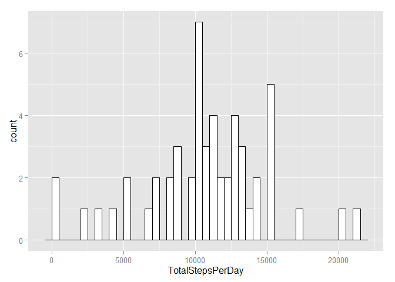
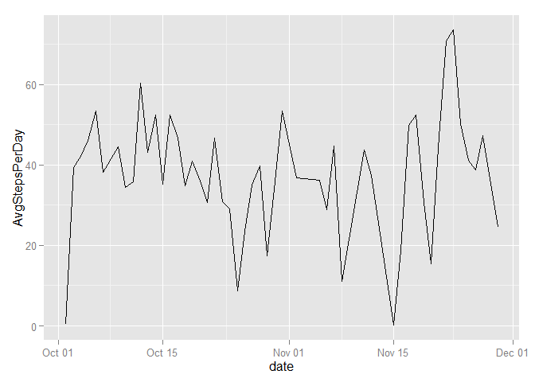
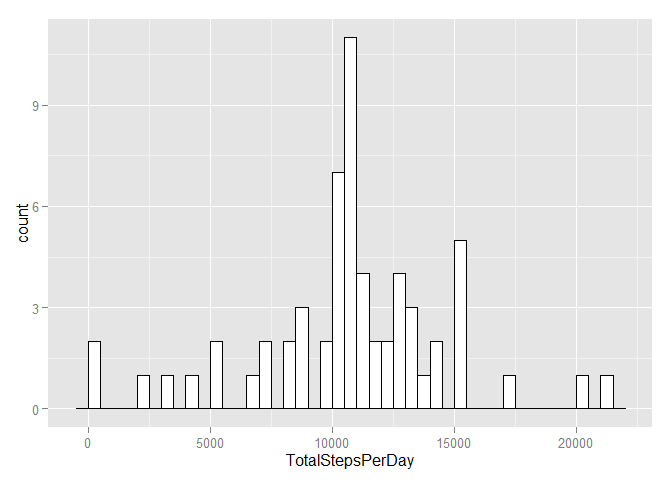
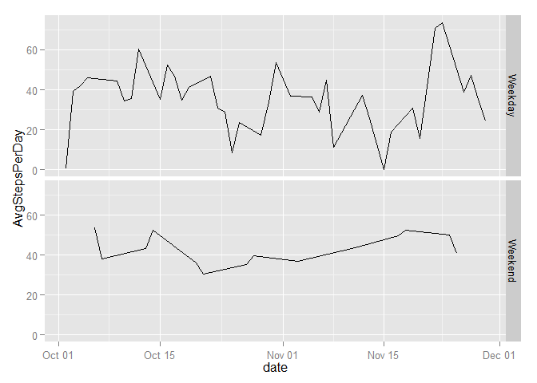

# Reproducible Research: Peer Assessment 1


## Loading and preprocessing the data
1. First step is to unzip
1. Read the unzipped CSV file into a dataframe, this file has a header and is comma seperated
1. make sure that the "date" field is formatted as a Date
1. Remove NA as a preprocessing step

```r
unzip("activity.zip", overwrite=TRUE, exdir=".")
activityDF <- read.csv("activity.csv", header=TRUE, sep=",")
activityDF$date <- as.Date(activityDF$date)
activityDF_noNA <- na.omit(activityDF)
```

## What is mean total number of steps taken per day?
1. use the dataset with NA removed
1. First using the plyr library, calculate the total steps per day
1. With the calculated total steps per day, calculate the mean
1. With the calculated total steps per day, calculate the median
1. Using ggplot2 library, create a histogram of the total steps per day
1. Output mean and median of stepsPerDayTotal

```r
library(plyr)

stepsPerDayTotal <- ddply(activityDF_noNA, c("date"), summarise, TotalStepsPerDay = sum(steps))
stepsPerDayMean <- mean(stepsPerDayTotal$TotalStepsPerDay)
stepsPerDayMedian <- median(stepsPerDayTotal$TotalStepsPerDay)

library(ggplot2)
ggplot(stepsPerDayTotal, aes(x=TotalStepsPerDay)) + 
        geom_histogram(binwidth=500, colour="black", fill="white")
```

 

```r
stepsPerDayMean
```

```
## [1] 10766.19
```

```r
stepsPerDayMedian
```

```
## [1] 10765
```

## What is the average daily activity pattern?
1. Calculate the average steps per day using the dataset with NA removed
1. Create the required plot 

```r
stepsPerDayAvg <- ddply(activityDF_noNA, c("date"), summarise, AvgStepsPerDay = mean(steps))
ggplot(stepsPerDayAvg, aes(x=date, y=AvgStepsPerDay)) + geom_line()
```

 


## Imputing missing values
1. Count number of NA's and output
1. Create a dataframe to be used for imputing
1. Replace the NA with the mean of the entire dataframe steps per day (without NA's)
1. Calculate imputed Steps Per Day Total
1. Make the histogram plot
1. Output Mean and Median   

## Impact of imputing
The impact of imputing with the dataset average, at least on the historgram, only made the average even larger.  Because of the impute method used, the mean and median didn't really change much.


```r
sum(is.na(activityDF$steps))
```

```
## [1] 2304
```

```r
imputeActivityDF <- activityDF
imputeActivityDF$steps[is.na(imputeActivityDF$steps)] = mean(imputeActivityDF$steps, na.rm=TRUE)
imputeStepsPerDayTotal <- ddply(imputeActivityDF, c("date"), summarise, TotalStepsPerDay = sum(steps))
imputeStepsPerDayMean <- mean(imputeStepsPerDayTotal$TotalStepsPerDay)
imputeStepsPerDayMedian <- median(imputeStepsPerDayTotal$TotalStepsPerDay)
ggplot(imputeStepsPerDayTotal, aes(x=TotalStepsPerDay)) + 
        geom_histogram(binwidth=500, colour="black", fill="white")
```

 

```r
imputeStepsPerDayMean
```

```
## [1] 10766.19
```

```r
imputeStepsPerDayMedian
```

```
## [1] 10766.19
```

## Are there differences in activity patterns between weekdays and weekends?
1. Create a dataset with the average steps per day
1. Create column with the a weekdays column
1. Make the isWeekend column easy to plot with a True/False
1. Create the plot

```r
stepsPerDayAvg_noNA <- ddply(activityDF, c("date"), summarise, AvgStepsPerDay = mean(steps))
stepsPerDayAvg$weekDays <- weekdays(stepsPerDayAvg$date, abbreviate=TRUE)
stepsPerDayAvg$isWeekend <- with(stepsPerDayAvg, ifelse(weekDays %in% c('Sat', 'Sun'), 'Weekend', 'Weekday'))
ggplot(stepsPerDayAvg, aes(x=date, y=AvgStepsPerDay)) + geom_line() + facet_grid(isWeekend ~ .)
```

 
